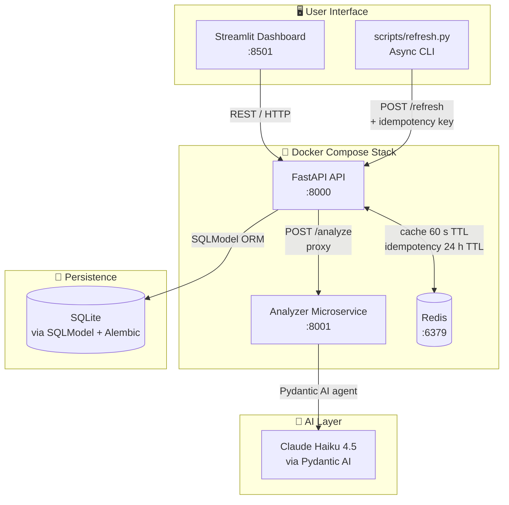

# Prompt Vault


> **A personal library for saving, rating, and managing AI prompts that actually work.**
> Built incrementally across three exercises for the EASS course (HIT, 2026 Class IX).

---

## Architecture



---

## ⚡ Quick Start

### Option A — Local (uv)

```bash
# 1. Clone and install
git clone https://github.com/EASS-HIT-PART-A-2026-CLASS-IX/prompt-vault.git
cd prompt-vault
uv sync

# 2. Apply migrations and seed sample data
uv run alembic upgrade head
uv run python -m prompt_vault.scripts.seed_db

# 3. Start the API and dashboard side-by-side
uv run uvicorn prompt_vault.app.main:app --reload   # http://localhost:8000
uv run streamlit run dashboard/app.py              # http://localhost:8501
```

### Option B — Docker Compose (full stack)

```bash
cp .env.example .env          # set ANTHROPIC_API_KEY for real LLM analysis
docker compose up --build
```

| URL | What's there |
|---|---|
| `http://localhost:8000/docs` | Interactive API explorer (Swagger UI) |
| `http://localhost:8501` | Streamlit dashboard |
| `http://localhost:8001/health` | Analyzer microservice health |

---

## ✨ Features

| | Feature | How to use |
|---|---|---|
| ✅ | CRUD prompt library | `GET/POST/PATCH/DELETE /prompts` |
| ✅ | Tag & category filtering | Browse tab → filter controls |
| ✅ | Redis cache + rate limiting | 60 s list cache · 30 req/min via Compose |
| ✅ | CSV export | `GET /prompts?format=csv` |
| ✅ | Async refresh with idempotency | `uv run python scripts/refresh.py run` |
| ✅ | JWT auth + role-based access | `POST /token` · editor-only on write routes |
| ✅ | LLM prompt analyzer (Pydantic AI) | `POST /prompts/{id}/analyze` · **Analyze with AI** button |
| ✅ | Streamlit dashboard | Browse · Add · Analytics · Analyze |
| ✅ | GitHub Actions CI | pytest + Schemathesis on every push |

---

## 🗂️ Project Structure

```
prompt-vault/
├── prompt_vault/
│   ├── app/
│   │   ├── config.py          # pydantic-settings (env vars + .env)
│   │   ├── models.py          # SQLModel table + Pydantic schemas
│   │   ├── database.py        # engine, session, init_db
│   │   ├── repository.py      # CRUD logic
│   │   ├── cache.py           # optional Redis helper
│   │   ├── rate_limit.py      # async ASGI rate-limit middleware
│   │   ├── security.py        # bcrypt hashing + JWT + require_role
│   │   ├── dependencies.py    # FastAPI dependency wiring
│   │   ├── routes/
│   │   │   └── auth.py        # POST /token
│   │   └── main.py            # all routes
│   ├── tests/
│   │   ├── conftest.py        # hermetic SQLite + auth bypass fixtures
│   │   ├── test_prompts.py    # CRUD + CSV + health (22 tests)
│   │   ├── test_refresh.py    # async refresher + idempotency (4 tests)
│   │   ├── test_security.py   # JWT / RBAC (12 tests)
│   │   ├── test_analyzer.py   # LLM proxy + microservice (6 tests)
│   │   └── test_dashboard.py  # Streamlit helpers (4 tests)
│   └── scripts/
│       └── seed_db.py         # sample data seeder
├── analyzer/
│   ├── agent.py               # Pydantic AI agent (mock fallback)
│   ├── main.py                # GET /health · POST /analyze
│   ├── schemas.py             # AnalyzeRequest / AnalyzeResponse
│   └── Dockerfile
├── dashboard/
│   └── app.py                 # Streamlit UI (Browse · Add · Analytics)
├── scripts/
│   ├── refresh.py             # async CLI refresher (Semaphore + tenacity)
│   └── demo.sh                # 10-step end-to-end demo
├── docs/
│   ├── EX3-notes.md           # architecture decisions + log excerpts
│   └── runbooks/
│       └── compose.md         # Compose launch · health checks · CI/Schemathesis
├── migrations/                # Alembic schema history
├── .github/
│   └── workflows/
│       └── ci.yaml            # pytest + Schemathesis jobs
├── compose.yaml
├── Dockerfile
├── prompts.http               # VS Code REST Client playground
└── .env.example
```

---

## 🔌 API Reference

### Public routes

| Method | Path | Description |
|---|---|---|
| `GET` | `/health` | Status + Redis + analyzer URL |
| `GET` | `/prompts` | List prompts (`?skip` `?limit` `?format=csv`) |
| `POST` | `/prompts` | Save a new prompt |
| `GET` | `/prompts/{id}` | Get one prompt |
| `POST` | `/prompts/{id}/analyze` | Score quality via LLM analyzer |
| `POST` | `/token` | Exchange credentials for a JWT |

### Editor-only routes (require `Authorization: Bearer <token>`)

| Method | Path | Description |
|---|---|---|
| `PATCH` | `/prompts/{id}` | Update effectiveness, notes, etc. |
| `DELETE` | `/prompts/{id}` | Remove a prompt |
| `POST` | `/prompts/{id}/refresh` | Re-estimate token count (Redis idempotency) |

### Example: full flow

```bash
# 1 — Get a token
TOKEN=$(curl -s -X POST http://localhost:8000/token \
  -d "username=admin&password=vault-admin" \
  -H "Content-Type: application/x-www-form-urlencoded" | jq -r '.access_token')

# 2 — Create a prompt (public)
ID=$(curl -s -X POST http://localhost:8000/prompts \
  -H "Content-Type: application/json" \
  -d '{"title":"Test","text":"Do X","model":"claude-sonnet-4-6",
       "category":"coding","task_type":"test","effectiveness":3}' | jq '.id')

# 3 — Analyze it
curl -s http://localhost:8000/prompts/$ID/analyze | jq

# 4 — Export to CSV
curl -o prompts.csv "http://localhost:8000/prompts?format=csv"
```

---

## 🔐 Security

Passwords are hashed with **bcrypt** (cost 12) and never stored in plaintext.
JWTs use **HS256** and carry `sub`, `iat`, `exp`, `iss`, `aud`, and `roles` claims.

| User | Password | Roles |
|---|---|---|
| `admin` | `vault-admin` | `editor`, `student` |
| `student` | `vault-student` | `student` |

See `docs/EX3-notes.md` for JWT claims detail and secret-rotation steps.

---

## 🔄 Async Refresh

```bash
# Refresh token estimates for 10 prompts, 3 at a time
uv run python scripts/refresh.py run --limit 10 --concurrency 3
```

Features: `asyncio.Semaphore` (bounded parallelism), `tenacity` exponential-jitter retries,
and Redis idempotency keys — a duplicate run within 24 h is a no-op.

---

## 🧪 Testing

```bash
uv run pytest          # runs all 47 tests (no Redis or API key needed)
uv run pytest -v -k security   # run only security tests
```

| File | Coverage | Count |
|---|---|---|
| `test_prompts.py` | CRUD, CSV export, health | 22 |
| `test_security.py` | login, JWT expiry, RBAC | 12 |
| `test_analyzer.py` | LLM proxy, mock fallback, 503 | 6 |
| `test_refresh.py` | async script, idempotency | 4 |
| `test_dashboard.py` | Streamlit helpers | 4 |

All tests use an in-memory SQLite database and `fakeredis` — no external services needed.

---

## 🎬 Demo

```bash
# Start the API first, then:
bash scripts/demo.sh
```

Walks through health check, seeding, JSON/CSV listing, JWT login, create, refresh,
auth rejection, async refresh CLI, and dashboard instructions in ~90 seconds.

---

## 📦 Data Model

| Field | Type | Constraints |
|---|---|---|
| `id` | int | Auto, primary key |
| `title` | str | 1–100 chars |
| `text` | str | Required |
| `model` | str | e.g. `claude-sonnet-4-6`, `gpt-4o` |
| `category` | enum | `coding / writing / debugging / learning / other` |
| `task_type` | str | e.g. `explain concept`, `code review` |
| `effectiveness` | int | 1–5 |
| `tags` | str | Comma-separated, auto-lowercased |
| `notes` | str | Optional |
| `token_count` | int | Optional, ≥ 1 |
| `version` | int | Default 1 |

---

## 🤖 AI Assistance

**EX1 (FastAPI backend):** FastAPI + SQLModel + Alembic scaffolding drafted with AI assistance. All code reviewed manually; tests verified via `pytest` and `curl`.

**EX2 (Streamlit dashboard):** Three-tab layout, filter logic, and form validation drafted with AI. Tested manually by running API + dashboard side-by-side.

**EX3 (Full-stack microservices):** Redis caching, rate limiting, async refresh, JWT security, Pydantic AI analyzer microservice, CSV export, Docker Compose orchestration, and CI pipeline all developed with AI assistance. Every session's deliverable was reviewed against the exercises spec and verified green (`uv run pytest`) before committing.
